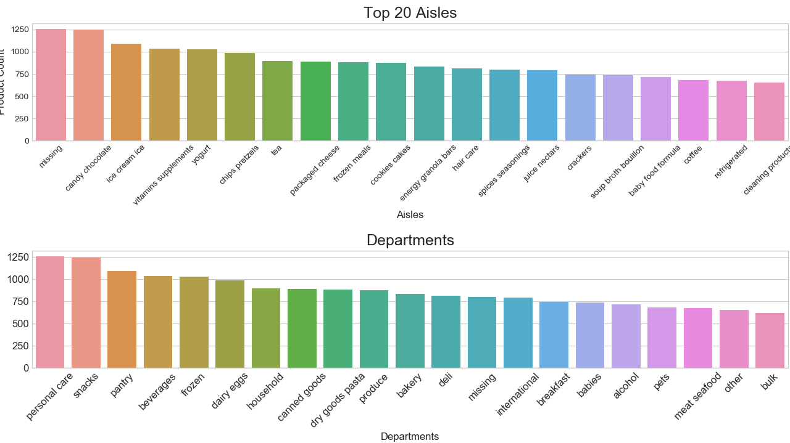
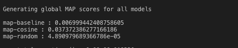

_(This Project is still work in progress, please forgive the messy codebase)_
## Implicit Recommender System
In this project I'm trying to build a recommender system based on the dataset published by [Instacart](https://www.instacart.com/datasets/grocery-shopping-2017)
Dataset contains over **3 Million+** transaction records of over **200K+ users**, with around **50k Products**.

### Goal
- My goal was to create a implicit collaborative filtering based recommender system based on this transactional dataset. I ended up creating different models to generate recommendations. I used **Mean Average Precision** as my measure for my models recommendations. Here is the list of my goals for this project:
    - Start with randomly recommending products from top 60 most purchased products.
    - Move on to generating Item-similarity based recommender system using **cosine similarity** as a distance measure.(Cosine similarity is based on co-occurances of the of products purchased together)
    - Generate a Matrix factorisation based recommender using **Alternate Least Square** method.
    - Generate a Matrix factorisation based recommender using **Latent Semantic Analysis** method._(Still Pending)_
    - Use a **Approximate Nearest Neighbour** algorithm to speed up the search for recommendations. _(Still Pending)_
    - Figure out a way to deploy this as a webapp. _(Still Pending)_

### Data Description:
In total, data set consist of about 3 million Instacart orders, of over 200k customers. The dataset consists of multiple files. Brief description of which is given below:
| file_name       | Description |
| :------------- | :---------- | 
|  orders.csv    | 3.4 million rows, 206k Users, **order_id**: order identifier **user_id**: customer identifier eval_set: which evaluation set this order belongs in (see SET described below) order_number: the order sequence number for this user (1 = first, n = nth) order_dow: the day of the week the order was placed on order_hour_of_day: the hour of the day the order was placed on  days_since_prior: days since the last order, capped at 30 (with NAs for order_number = 1) |
|   products.csv   | 50k rows, **product_id**: product identifier **product_name**: name of the product |
|   aisles.csv      | 134 rows, **aisle_id**: aisle identifier  **aisle**: the name of the aisle    |
|   departments.csv  | 21 rows, **department_id**: department identifier **department**: the name of the department    |
|   Order_products_SET.csv  | (30 million + rows) These files specify which products were purchased in each order. order_products__prior.csv contains previous order contents for all customers. 'reordered' indicates that the customer has a previous order that contains the product. Note that some orders will have no reordered items. **order_id**: foreign key  **product_id**: foreign key  **add_to_cart_order**: order in which each product was added to cart  **reordered**: 1 if this product has been ordered by this user in the past, 0 otherwise where SET is one of the four following evaluation sets (eval_set in orders): -  "**prior**": orders prior to that users most recent order (3.2m orders)   - "**train**": training data supplied (131k orders)   - "**test**": test data reserved for machine learning models (75k orders)  |

The dataset is a relational set of files describing customers' orders over time. The goal is to predict which products will be in a user's next order. For each user, we have between 4 and 100 of their orders, with the sequence of products purchased in each order. We also have the week and hour of day the order was placed, and a relative measure of time between orders.
 
### Steps Taken:
Broadly the steps I've taken so far are:
- Load and Process data: 
  - I was facing memory problems while processing the data in Python, so I used **Apache Spark** to perform initial data processing. 
  - Spark code, written in **Scala** imports the data and after processing it, outputs a co-occurance matrix of all the purchases for 200k users and calculates cosine similarities between all the products (based on co-occurances). It outputs the processed data in *.csv* format.
  #### Models:
 - **Random Model:** Just to get a sense of how my subsequent models improve, I created a model to random recommender, which randomly recommends a product out of total 50k products database
 - **Baseline Model:** My baseline model recommends from Top 100 most purchased model, intuition is that because they are most purchased, user will buy this at some point.
 - **Cosine Similarity based Model**: Using the generated simialrity matrix above, this model generates recommendations based on Users 2nd Last order, It basically goes through each product in the cart and suggests top _K_ most similar products in the basket. Since my similarty matrix is based on co-occurances of purchases, I'm assuming most similar product from last order maybe a best bet.
 - **ALS based Model**:decompose the cooccurance matrix above using ALS and generate recommendations
 - compare the recommendations to the last order and generate **MAP** score

### Result:
Latest MAP scores so far:  

### Use :
If you  need to use and run the code: You need to download data published by [Instacart, here.](https://www.instacart.com/datasets/grocery-shopping-2017)  and extract it in data folder for the import to work. 

### Main files:
#### Scala Files:
- src/main/scala/InstacartMain.scala : main file for spark processes, acts as a pipeline.
- src/main/scala/etl/dataProcessing.Scala : as name suggests, Main function which processes all data files.
- src/main/scala/ItemMatrix.scala: This file generates Item-Item Cooccurance matrix
- src/main/scala/CosineSimilarity.scala: This file generates cosine simialrity between all 50k products based on the co-occurance matrix generated above.

#### Python Files:
- src/main/python/predictions.py : Does the heavy work of generating predictions for all models except ALS.
- src/main/python/als.py : Implementation of Alternate Least Squares Matrix Factorisation using implicit package.

